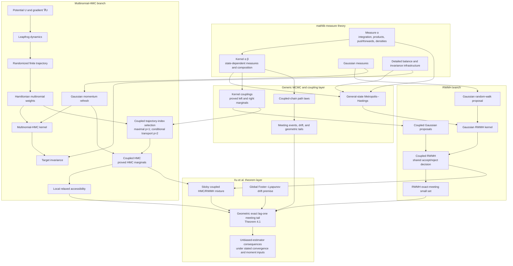
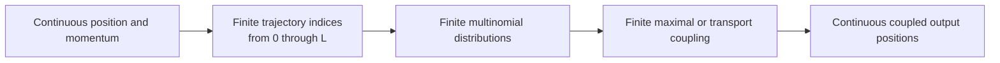

# Formalization architecture

This document shows how the formalization is layered from mathlib's
measure-theoretic foundations through the implemented RWMH and multinomial-HMC
algorithms to the main meeting result of Xu, Fjelde, Sutton, and Ge.

## End-to-end dependency graph



The two algorithm branches are concrete: RWMH and multinomial HMC are defined
as mathlib kernels and proved correct before they are used in the coupled
mixture. The final theorem does not assume opaque single-chain algorithms.

## Where the finite layer fits

The chain state and momentum spaces are continuous, but a multinomial-HMC
transition selects from a finite leapfrog trajectory. Finite probability and
transport are therefore an internal component of the general-state kernel,
not a restriction of the final theorem to finite state spaces.



The reusable finite coupling and transport definitions live under
`McmcLean/Finite/`. Their measurable kernel lifts connect finite index
couplings back to the continuous phase-space kernels.

## Logical boundary of the main theorem

The important implication structure is

```text
regularity + local strong convexity
  -> cutoff-wise positive-window HMC contraction
  -> local relaxed accessibility

local relaxed accessibility
  + RWMH exact-meeting small set
  + global drift for the selected HMC/RWMH kernels
  -> geometric exact lag-one meeting tail
```

Local strong convexity does not imply the global drift premise. Geometric
meeting also does not, by itself, prove marginal convergence from arbitrary
initial states. Those obligations remain explicit at theorem endpoints.

## Main module map

- `McmcLean/Kernel/MetropolisHastings.lean` defines general-state MH.
- `McmcLean/Kernel/RandomWalkMetropolisHastings.lean` specializes it to
  Gaussian RWMH.
- `McmcLean/Kernel/CoupledMetropolisHastings.lean` constructs coupled MH with
  proved marginals.
- `McmcLean/Hamiltonian/Leapfrog.lean` defines the deterministic integrator.
- `McmcLean/Hamiltonian/MultinomialHMC.lean` constructs the multinomial-HMC
  transition.
- `McmcLean/Hamiltonian/Invariance.lean` proves its invariance properties.
- `McmcLean/Hamiltonian/CoupledMultinomialHMC.lean` constructs coupled HMC with
  proved marginals.
- `McmcLean/Hamiltonian/LocalContractivity.lean` connects the repaired Xu
  conditions to local accessibility.
- `McmcLean/Kernel/MeetingDrift.lean` contains the abstract drift and meeting
  machinery.
- `McmcLean/Hamiltonian/CoupledMixture.lean` assembles the concrete mixture and
  Xu-style geometric meeting theorem.
- `McmcLean/Kernel/UnbiasedEstimator.lean` develops downstream estimator
  consequences.

See [`xu21-coverage.md`](xu21-coverage.md) for the claim-by-claim
correspondence with the 2021 paper.
