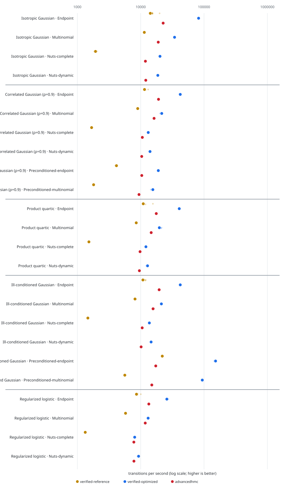

# HMC benchmark report

This is a reproducible implementation benchmark, not a theorem about convergence or a claim that Float64 execution is identical to the exact-real Lean semantics.

```@raw html
<div id="hmc-benchmark-explorer" class="benchmark-explorer" aria-label="Interactive HMC benchmark explorer">
  <p class="benchmark-loading">Loading interactive benchmark…</p>
</div>
```

The interactive chart supports metric, target, algorithm, implementation, and grouping controls. Hover over a point for its chain seed and repetition or its aggregate quality diagnostics.

??? note "Static chart fallback"
    The committed SVG remains available for non-JavaScript readers and portable rendering.

    

Rows are grouped first by target and then by algorithm. Within each row, colors compare libraries implementing that same `target × algorithm` case. Small translucent points are complete-chain timing repetitions; large points and thick intervals are medians and IQRs. The shared logarithmic axis retains absolute throughput and remains extensible to additional libraries.

Preconditioned endpoint and multinomial rows include VerifiedSamplers' Reference and Optimized constant-metric paths.

VerifiedSamplers `NUTS` is labelled `verified-reference`: it uses the completed-tree C.4 rerooting construction proved in Lean. The independent handwritten `Optimized.NUTS` is labelled `verified-optimized`; that label identifies the project's optimized implementation, for which conformance and statistical tests are empirical evidence rather than a formal transition-equivalence proof.

## Configuration

- Commit: `c744033`
- Julia: `1.12.5`
- CPU: `Intel Xeon Processor (SapphireRapids)`
- Dimension: `100`
- Draws per measured chain: `10000`
- Complete-chain timing repetitions per case: `10`
- Step size: `0.08`
- Fixed trajectory length: `10` leapfrog steps
- Gradients: analytic callbacks for both packages; AD time excluded

- Fixed timed/quality seeds per case: `4109, 4110, 4111, 4112, 4113, 4114, 4115, 4116, 4117, 4118`
- Retained timed chains per case: `10`

## Results

### Median transitions per second

#### Endpoint

| Target | verified-reference | verified-optimized | advancedhmc |
|---|---:|---:|---:|
| Isotropic Gaussian | 15012 | 84484 | 24144 |
| Correlated Gaussian (ρ=0.9) | 12139 | 43913 | 20276 |
| Product quartic | 11645 | 43504 | 18279 |
| Ill-conditioned Gaussian | 11450 | 43658 | 19647 |
| Regularized logistic | 8875 | 29315 | 13996 |

#### Multinomial

| Target | verified-reference | verified-optimized | advancedhmc |
|---|---:|---:|---:|
| Isotropic Gaussian | 11918 | 36276 | 20032 |
| Correlated Gaussian (ρ=0.9) | 9419 | 21467 | 16617 |
| Product quartic | 8780 | 20848 | 15635 |
| Ill-conditioned Gaussian | 8617 | 22766 | 17461 |
| Regularized logistic | 5834 | 13531 | 12252 |

#### Nuts

| Target | verified-reference | verified-optimized | advancedhmc |
|---|---:|---:|---:|
| Isotropic Gaussian | 2038 | 4876 | 5281 |
| Correlated Gaussian (ρ=0.9) | 1722 | 2180 | 2369 |
| Product quartic | 1591 | 6437 | 6227 |
| Ill-conditioned Gaussian | 1514 | 907 | 824 |
| Regularized logistic | 1330 | 3066 | 3001 |

#### Preconditioned-endpoint

| Target | verified-reference | verified-optimized | advancedhmc |
|---|---:|---:|---:|
| Correlated Gaussian (ρ=0.9) | 3290 | 6489 | 10654 |
| Ill-conditioned Gaussian | 23260 | 59260 | 18464 |

#### Preconditioned-multinomial

| Target | verified-reference | verified-optimized | advancedhmc |
|---|---:|---:|---:|
| Correlated Gaussian (ρ=0.9) | 1988 | 3956 | 10061 |
| Ill-conditioned Gaussian | 6085 | 15428 | 15807 |

### Complete summary

| Target | Algorithm | Implementation | Median | IQR | Draws/s | Mean steps | Allocations |
|---|---|---|---:|---:|---:|---:|---:|
| Isotropic Gaussian | endpoint | verified-reference | 666.1 ms | 653.4–679.5 ms | 15012 | 10.0 | n/a |
| Isotropic Gaussian | endpoint | verified-optimized | 118.4 ms | 117.2–119.2 ms | 84484 | 10.0 | n/a |
| Isotropic Gaussian | endpoint | advancedhmc | 414.2 ms | 407.3–421.6 ms | 24144 | 10.0 | n/a |
| Isotropic Gaussian | multinomial | verified-reference | 839.1 ms | 822.9–841.7 ms | 11918 | 10.0 | n/a |
| Isotropic Gaussian | multinomial | verified-optimized | 275.7 ms | 275.2–276.6 ms | 36276 | 10.0 | n/a |
| Isotropic Gaussian | multinomial | advancedhmc | 499.2 ms | 495.9–500.1 ms | 20032 | 10.0 | n/a |
| Isotropic Gaussian | nuts | verified-reference | 4906.3 ms | 4775.9–5069.5 ms | 2038 | 16.0 | n/a |
| Isotropic Gaussian | nuts | verified-optimized | 2050.7 ms | 2036.0–2160.0 ms | 4876 | 63.0 | n/a |
| Isotropic Gaussian | nuts | advancedhmc | 1893.6 ms | 1862.9–2025.9 ms | 5281 | 63.0 | n/a |
| Correlated Gaussian (ρ=0.9) | endpoint | verified-reference | 823.8 ms | 807.2–842.1 ms | 12139 | 10.0 | n/a |
| Correlated Gaussian (ρ=0.9) | endpoint | verified-optimized | 227.7 ms | 226.6–228.9 ms | 43913 | 10.0 | n/a |
| Correlated Gaussian (ρ=0.9) | endpoint | advancedhmc | 493.2 ms | 491.4–518.3 ms | 20276 | 10.0 | n/a |
| Correlated Gaussian (ρ=0.9) | multinomial | verified-reference | 1061.7 ms | 1048.9–1173.1 ms | 9419 | 10.0 | n/a |
| Correlated Gaussian (ρ=0.9) | multinomial | verified-optimized | 465.8 ms | 433.3–549.9 ms | 21467 | 10.0 | n/a |
| Correlated Gaussian (ρ=0.9) | multinomial | advancedhmc | 601.8 ms | 584.6–671.6 ms | 16617 | 10.0 | n/a |
| Correlated Gaussian (ρ=0.9) | nuts | verified-reference | 5807.9 ms | 5673.1–6155.3 ms | 1722 | 16.0 | n/a |
| Correlated Gaussian (ρ=0.9) | nuts | verified-optimized | 4587.9 ms | 4356.3–4656.3 ms | 2180 | 122.6 | n/a |
| Correlated Gaussian (ρ=0.9) | nuts | advancedhmc | 4221.0 ms | 4164.7–4582.0 ms | 2369 | 122.4 | n/a |
| Correlated Gaussian (ρ=0.9) | preconditioned-endpoint | verified-reference | 3039.1 ms | 2237.2–3066.5 ms | 3290 | 10.0 | n/a |
| Correlated Gaussian (ρ=0.9) | preconditioned-endpoint | verified-optimized | 1541.2 ms | 1506.9–1654.4 ms | 6489 | 10.0 | n/a |
| Correlated Gaussian (ρ=0.9) | preconditioned-endpoint | advancedhmc | 938.7 ms | 900.3–1062.0 ms | 10654 | 10.0 | n/a |
| Correlated Gaussian (ρ=0.9) | preconditioned-multinomial | verified-reference | 5031.3 ms | 4875.7–5297.1 ms | 1988 | 10.0 | n/a |
| Correlated Gaussian (ρ=0.9) | preconditioned-multinomial | verified-optimized | 2527.9 ms | 2502.0–2684.3 ms | 3956 | 10.0 | n/a |
| Correlated Gaussian (ρ=0.9) | preconditioned-multinomial | advancedhmc | 993.9 ms | 990.4–1002.0 ms | 10061 | 10.0 | n/a |
| Product quartic | endpoint | verified-reference | 858.7 ms | 835.9–953.4 ms | 11645 | 10.0 | n/a |
| Product quartic | endpoint | verified-optimized | 229.9 ms | 228.5–232.6 ms | 43504 | 10.0 | n/a |
| Product quartic | endpoint | advancedhmc | 547.1 ms | 543.0–646.6 ms | 18279 | 10.0 | n/a |
| Product quartic | multinomial | verified-reference | 1139.0 ms | 1107.7–1300.3 ms | 8780 | 10.0 | n/a |
| Product quartic | multinomial | verified-optimized | 479.7 ms | 475.6–563.4 ms | 20848 | 10.0 | n/a |
| Product quartic | multinomial | advancedhmc | 639.6 ms | 635.9–647.0 ms | 15635 | 10.0 | n/a |
| Product quartic | nuts | verified-reference | 6286.0 ms | 6259.3–6774.9 ms | 1591 | 16.0 | n/a |
| Product quartic | nuts | verified-optimized | 1553.5 ms | 1525.3–1777.8 ms | 6437 | 31.0 | n/a |
| Product quartic | nuts | advancedhmc | 1605.9 ms | 1581.8–1631.8 ms | 6227 | 31.0 | n/a |
| Ill-conditioned Gaussian | endpoint | verified-reference | 873.3 ms | 860.2–884.1 ms | 11450 | 10.0 | n/a |
| Ill-conditioned Gaussian | endpoint | verified-optimized | 229.1 ms | 228.0–230.2 ms | 43658 | 10.0 | n/a |
| Ill-conditioned Gaussian | endpoint | advancedhmc | 509.0 ms | 484.8–630.2 ms | 19647 | 10.0 | n/a |
| Ill-conditioned Gaussian | multinomial | verified-reference | 1160.4 ms | 1148.8–1168.3 ms | 8617 | 10.0 | n/a |
| Ill-conditioned Gaussian | multinomial | verified-optimized | 439.3 ms | 437.9–440.5 ms | 22766 | 10.0 | n/a |
| Ill-conditioned Gaussian | multinomial | advancedhmc | 572.7 ms | 570.6–576.0 ms | 17461 | 10.0 | n/a |
| Ill-conditioned Gaussian | nuts | verified-reference | 6605.2 ms | 6482.4–6725.4 ms | 1514 | 16.0 | n/a |
| Ill-conditioned Gaussian | nuts | verified-optimized | 11029.6 ms | 10667.2–11119.0 ms | 907 | 323.1 | n/a |
| Ill-conditioned Gaussian | nuts | advancedhmc | 12136.0 ms | 11989.4–12653.4 ms | 824 | 323.4 | n/a |
| Ill-conditioned Gaussian | preconditioned-endpoint | verified-reference | 429.9 ms | 421.6–487.5 ms | 23260 | 10.0 | n/a |
| Ill-conditioned Gaussian | preconditioned-endpoint | verified-optimized | 168.7 ms | 168.3–168.9 ms | 59260 | 10.0 | n/a |
| Ill-conditioned Gaussian | preconditioned-endpoint | advancedhmc | 541.6 ms | 540.4–640.7 ms | 18464 | 10.0 | n/a |
| Ill-conditioned Gaussian | preconditioned-multinomial | verified-reference | 1643.4 ms | 1633.6–1666.4 ms | 6085 | 10.0 | n/a |
| Ill-conditioned Gaussian | preconditioned-multinomial | verified-optimized | 648.2 ms | 639.2–694.2 ms | 15428 | 10.0 | n/a |
| Ill-conditioned Gaussian | preconditioned-multinomial | advancedhmc | 632.6 ms | 629.0–636.6 ms | 15807 | 10.0 | n/a |
| Regularized logistic | endpoint | verified-reference | 1126.7 ms | 1100.3–1157.9 ms | 8875 | 10.0 | n/a |
| Regularized logistic | endpoint | verified-optimized | 341.1 ms | 338.6–344.4 ms | 29315 | 10.0 | n/a |
| Regularized logistic | endpoint | advancedhmc | 714.5 ms | 709.6–716.0 ms | 13996 | 10.0 | n/a |
| Regularized logistic | multinomial | verified-reference | 1714.1 ms | 1690.9–1725.9 ms | 5834 | 10.0 | n/a |
| Regularized logistic | multinomial | verified-optimized | 739.0 ms | 737.6–1016.4 ms | 13531 | 10.0 | n/a |
| Regularized logistic | multinomial | advancedhmc | 816.2 ms | 805.8–984.5 ms | 12252 | 10.0 | n/a |
| Regularized logistic | nuts | verified-reference | 7516.5 ms | 7324.9–7799.3 ms | 1330 | 16.0 | n/a |
| Regularized logistic | nuts | verified-optimized | 3261.8 ms | 3217.8–3562.6 ms | 3066 | 50.4 | n/a |
| Regularized logistic | nuts | advancedhmc | 3331.7 ms | 3299.5–3652.6 ms | 3001 | 50.4 | n/a |

## Sampling quality

The same independently seeded full chains supply timing and quality evidence. Full-chain storage is included equally in every implementation's timing; diagnostics are computed afterward. Moment errors use each target's known zero mean and analytical or independently computed marginal variance. The table reports the worst split rank-normalized R-hat and minimum bulk/tail ESS among the first four coordinates after ten-percent per-chain burn-in. A warning marker at R-hat above 1.01 is conspicuous but non-gating.

| Target | Algorithm | Implementation | R-hat | Bulk ESS | Tail ESS | Bulk ESS/gradient proxy | Mean MCSE (max) | Covariance error (max) | Median error (max) | ESS/s | Mean RMSE (std.) | Variance RMSE (relative) | Movement | Acceptance | Divergences | Mean steps |
|---|---|---|---:|---:|---:|---:|---:|---:|---:|---:|---:|---:|---:|---:|---:|---:|
| Isotropic Gaussian | endpoint | verified-reference | 1.001 | 15042.3 | 30906.0 | 0.0075 | 0.0083 | 0.0250 | 0.0298 | 2347.7 | 0.009 | 0.009 | 0.996 | — | 0 | 10.0 |
| Isotropic Gaussian | endpoint | verified-optimized | 1.001 | 15042.3 | 30906.0 | 0.0075 | 0.0083 | 0.0250 | 0.0298 | 12848.1 | 0.009 | 0.009 | 0.996 | — | 0 | 10.0 |
| Isotropic Gaussian | endpoint | advancedhmc | 1.001 | 15179.2 | 31583.1 | 0.0152 | 0.0083 | 0.0219 | 0.0203 | 3601.7 | 0.008 | 0.007 | 0.995 | 0.995 | 0 | 10.0 |
| Isotropic Gaussian | multinomial | verified-reference | 1.003 | 2768.7 | 6427.5 | 0.0014 | 0.0183 | 0.0601 | 0.0502 | 313.2 | 0.018 | 0.021 | 0.909 | — | 0 | 10.0 |
| Isotropic Gaussian | multinomial | verified-optimized | 1.003 | 2768.7 | 6427.5 | 0.0014 | 0.0183 | 0.0601 | 0.0502 | 960.1 | 0.018 | 0.021 | 0.991 | — | 0 | 10.0 |
| Isotropic Gaussian | multinomial | advancedhmc | 1.006 | 2787.5 | 6409.1 | 0.0028 | 0.0177 | 0.0608 | 0.0518 | 537.4 | 0.016 | 0.020 | 0.909 | 0.998 | 0 | 10.0 |
| Isotropic Gaussian | nuts | verified-reference | 1.001 | 5919.4 | 11556.4 | 0.0018 | 0.0131 | 0.0393 | 0.0381 | 114.6 | 0.012 | 0.014 | 0.995 | — | 0 | 16.0 |
| Isotropic Gaussian | nuts | verified-optimized | 1.000 | 90000.0 | 68651.3 | 0.0071 | 0.0021 | 0.0219 | 0.0072 | 4192.0 | 0.002 | 0.008 | 1.000 | 0.996 | 0 | 63.0 |
| Isotropic Gaussian | nuts | advancedhmc | 1.000 | 90000.0 | 67827.6 | 0.0143 | 0.0022 | 0.0233 | 0.0071 | 4620.1 | 0.002 | 0.009 | 1.000 | 0.996 | 0 | 63.0 |
| Correlated Gaussian (ρ=0.9) | endpoint | verified-reference | 1.006 | 2040.0 | 5988.2 | 0.0010 | 0.0208 | 0.0547 | 0.0402 | 235.5 | 0.019 | 0.025 | 0.973 | — | 0 | 10.0 |
| Correlated Gaussian (ρ=0.9) | endpoint | verified-optimized | 1.006 | 2040.0 | 5988.2 | 0.0010 | 0.0208 | 0.0547 | 0.0402 | 840.8 | 0.019 | 0.025 | 0.973 | — | 0 | 10.0 |
| Correlated Gaussian (ρ=0.9) | endpoint | advancedhmc | 1.005 | 2372.8 | 6405.1 | 0.0024 | 0.0212 | 0.0552 | 0.0620 | 434.5 | 0.031 | 0.026 | 0.974 | 0.974 | 0 | 10.0 |
| Correlated Gaussian (ρ=0.9) | multinomial | verified-reference | ⚠ 1.020 | 537.0 | 2841.7 | 0.0003 | 0.0294 | 0.1682 | 0.0832 | 39.0 | 0.035 | 0.060 | 0.908 | — | 0 | 10.0 |
| Correlated Gaussian (ρ=0.9) | multinomial | verified-optimized | ⚠ 1.020 | 537.0 | 2841.7 | 0.0003 | 0.0294 | 0.1682 | 0.0832 | 90.8 | 0.035 | 0.060 | 0.991 | — | 0 | 10.0 |
| Correlated Gaussian (ρ=0.9) | multinomial | advancedhmc | ⚠ 1.031 | 604.4 | 2531.8 | 0.0006 | 0.0279 | 0.1029 | 0.1102 | 65.7 | 0.055 | 0.041 | 0.909 | 0.953 | 0 | 10.0 |
| Correlated Gaussian (ρ=0.9) | nuts | verified-reference | ⚠ 1.013 | 1003.0 | 3757.9 | 0.0003 | 0.0257 | 0.0842 | 0.0930 | 14.5 | 0.040 | 0.032 | 0.932 | — | 0 | 16.0 |
| Correlated Gaussian (ρ=0.9) | nuts | verified-optimized | 1.000 | 64132.9 | 65822.9 | 0.0026 | 0.0045 | 0.0123 | 0.0105 | 1418.3 | 0.004 | 0.005 | 1.000 | 0.948 | 0 | 122.6 |
| Correlated Gaussian (ρ=0.9) | nuts | advancedhmc | 1.000 | 62565.6 | 67093.6 | 0.0051 | 0.0046 | 0.0125 | 0.0128 | 1430.4 | 0.003 | 0.006 | 1.000 | 0.948 | 0 | 122.4 |
| Correlated Gaussian (ρ=0.9) | preconditioned-endpoint | verified-reference | 1.001 | 15195.3 | 33300.2 | 0.0076 | 0.0082 | 0.0260 | 0.0286 | 575.2 | 0.009 | 0.009 | 0.996 | — | 0 | 10.0 |
| Correlated Gaussian (ρ=0.9) | preconditioned-endpoint | verified-optimized | 1.001 | 15195.3 | 33300.2 | 0.0076 | 0.0082 | 0.0260 | 0.0286 | 973.9 | 0.009 | 0.009 | 0.996 | — | 0 | 10.0 |
| Correlated Gaussian (ρ=0.9) | preconditioned-endpoint | advancedhmc | 1.001 | 15789.1 | 32462.1 | 0.0158 | 0.0082 | 0.0194 | 0.0209 | 1636.9 | 0.010 | 0.007 | 0.995 | 0.995 | 0 | 10.0 |
| Correlated Gaussian (ρ=0.9) | preconditioned-multinomial | verified-reference | 1.003 | 2704.1 | 6205.3 | 0.0014 | 0.0182 | 0.0469 | 0.0309 | 54.7 | 0.014 | 0.020 | 0.909 | — | 0 | 10.0 |
| Correlated Gaussian (ρ=0.9) | preconditioned-multinomial | verified-optimized | 1.003 | 2704.1 | 6205.3 | 0.0014 | 0.0182 | 0.0469 | 0.0309 | 106.7 | 0.014 | 0.020 | 0.991 | — | 0 | 10.0 |
| Correlated Gaussian (ρ=0.9) | preconditioned-multinomial | advancedhmc | 1.005 | 2725.7 | 6263.5 | 0.0027 | 0.0181 | 0.0577 | 0.0572 | 257.9 | 0.019 | 0.023 | 0.909 | 0.998 | 0 | 10.0 |
| Product quartic | endpoint | verified-reference | 1.000 | 36720.4 | 84182.5 | 0.0184 | 0.0038 | — | 0.0204 | 3914.5 | 0.006 | 0.004 | 0.988 | — | 0 | 10.0 |
| Product quartic | endpoint | verified-optimized | 1.000 | 36720.4 | 84182.5 | 0.0184 | 0.0038 | — | 0.0204 | 14914.4 | 0.006 | 0.004 | 0.988 | — | 0 | 10.0 |
| Product quartic | endpoint | advancedhmc | 1.000 | 36781.8 | 86589.9 | 0.0368 | 0.0037 | — | 0.0123 | 6218.8 | 0.005 | 0.004 | 0.988 | 0.988 | 0 | 10.0 |
| Product quartic | multinomial | verified-reference | 1.001 | 5888.8 | 16258.9 | 0.0029 | 0.0090 | — | 0.0298 | 471.0 | 0.012 | 0.010 | 0.909 | — | 0 | 10.0 |
| Product quartic | multinomial | verified-optimized | 1.001 | 5888.8 | 16258.9 | 0.0029 | 0.0090 | — | 0.0298 | 1103.0 | 0.012 | 0.010 | 0.991 | — | 0 | 10.0 |
| Product quartic | multinomial | advancedhmc | 1.003 | 5782.8 | 16728.8 | 0.0058 | 0.0089 | — | 0.0274 | 897.6 | 0.012 | 0.011 | 0.909 | 0.990 | 0 | 10.0 |
| Product quartic | nuts | verified-reference | 1.001 | 12222.1 | 28538.8 | 0.0038 | 0.0063 | — | 0.0232 | 190.8 | 0.008 | 0.008 | 0.995 | — | 0 | 16.0 |
| Product quartic | nuts | verified-optimized | 1.000 | 90000.0 | 76482.6 | 0.0145 | 0.0020 | — | 0.0100 | 5462.3 | 0.003 | 0.005 | 1.000 | 0.988 | 0 | 31.0 |
| Product quartic | nuts | advancedhmc | 1.000 | 90000.0 | 78149.5 | 0.0290 | 0.0021 | — | 0.0070 | 5497.0 | 0.003 | 0.006 | 1.000 | 0.988 | 0 | 31.0 |
| Ill-conditioned Gaussian | endpoint | verified-reference | 1.001 | 16306.8 | 32614.1 | 0.0082 | 0.2984 | 16.9459 | 2.8810 | 1915.9 | 0.048 | 0.023 | 0.873 | — | 0 | 10.0 |
| Ill-conditioned Gaussian | endpoint | verified-optimized | 1.001 | 16306.8 | 32614.1 | 0.0082 | 0.2984 | 16.9459 | 2.8810 | 6960.2 | 0.048 | 0.023 | 0.873 | — | 0 | 10.0 |
| Ill-conditioned Gaussian | endpoint | advancedhmc | 1.000 | 16030.4 | 31434.9 | 0.0160 | 0.3020 | 8.1615 | 1.2309 | 2971.8 | 0.030 | 0.030 | 0.877 | 0.876 | 0 | 10.0 |
| Ill-conditioned Gaussian | multinomial | verified-reference | 1.000 | 79177.0 | 53043.3 | 0.0396 | 0.2795 | 20.1561 | 1.6843 | 6806.4 | 0.051 | 0.057 | 0.905 | — | 0 | 10.0 |
| Ill-conditioned Gaussian | multinomial | verified-optimized | 1.000 | 79177.0 | 53043.3 | 0.0396 | 0.2795 | 20.1561 | 1.6843 | 17888.8 | 0.051 | 0.057 | 0.991 | — | 0 | 10.0 |
| Ill-conditioned Gaussian | multinomial | advancedhmc | 1.000 | 79795.2 | 52953.3 | 0.0798 | 0.2680 | 19.4246 | 2.5623 | 13797.6 | 0.056 | 0.063 | 0.906 | 0.895 | 0 | 10.0 |
| Ill-conditioned Gaussian | nuts | verified-reference | 1.000 | 87055.4 | 54706.2 | 0.0272 | 0.3021 | 13.3298 | 1.2211 | 1327.9 | 0.035 | 0.038 | 0.995 | — | 0 | 16.0 |
| Ill-conditioned Gaussian | nuts | verified-optimized | 1.000 | 87473.8 | 58750.0 | 0.0014 | 0.0529 | 1.3289 | 0.0390 | 814.0 | 0.003 | 0.008 | 1.000 | 0.888 | 0 | 323.1 |
| Ill-conditioned Gaussian | nuts | advancedhmc | 1.000 | 86754.6 | 55567.6 | 0.0027 | 0.0522 | 0.6444 | 0.0697 | 713.7 | 0.003 | 0.008 | 1.000 | 0.889 | 0 | 323.4 |
| Ill-conditioned Gaussian | preconditioned-endpoint | verified-reference | 1.001 | 15042.3 | 30906.0 | 0.0075 | 0.0798 | 1.3167 | 0.2859 | 3313.6 | 0.009 | 0.009 | 0.996 | — | 0 | 10.0 |
| Ill-conditioned Gaussian | preconditioned-endpoint | verified-optimized | 1.001 | 15042.3 | 30906.0 | 0.0075 | 0.0798 | 1.3167 | 0.2859 | 8980.3 | 0.009 | 0.009 | 0.996 | — | 0 | 10.0 |
| Ill-conditioned Gaussian | preconditioned-endpoint | advancedhmc | 1.001 | 15179.2 | 31583.1 | 0.0152 | 0.0764 | 1.1941 | 0.1266 | 2632.5 | 0.008 | 0.007 | 0.995 | 0.995 | 0 | 10.0 |
| Ill-conditioned Gaussian | preconditioned-multinomial | verified-reference | 1.003 | 2768.7 | 6427.5 | 0.0014 | 0.1737 | 2.8200 | 0.2501 | 154.6 | 0.018 | 0.021 | 0.909 | — | 0 | 10.0 |
| Ill-conditioned Gaussian | preconditioned-multinomial | verified-optimized | 1.003 | 2768.7 | 6427.5 | 0.0014 | 0.1737 | 2.8200 | 0.2501 | 397.4 | 0.018 | 0.021 | 0.991 | — | 0 | 10.0 |
| Ill-conditioned Gaussian | preconditioned-multinomial | advancedhmc | 1.006 | 2787.5 | 6409.1 | 0.0028 | 0.1670 | 3.4796 | 0.3842 | 425.6 | 0.016 | 0.020 | 0.909 | 0.998 | 0 | 10.0 |
| Regularized logistic | endpoint | verified-reference | 1.000 | 23123.2 | 41791.1 | 0.0116 | 0.0057 | — | 0.0208 | 1982.9 | 0.007 | 0.008 | 0.992 | — | 0 | 10.0 |
| Regularized logistic | endpoint | verified-optimized | 1.000 | 23123.2 | 41791.1 | 0.0116 | 0.0057 | — | 0.0208 | 6316.8 | 0.007 | 0.008 | 0.992 | — | 0 | 10.0 |
| Regularized logistic | endpoint | advancedhmc | 1.001 | 23430.9 | 41867.0 | 0.0234 | 0.0057 | — | 0.0130 | 3219.4 | 0.007 | 0.007 | 0.992 | 0.992 | 0 | 10.0 |
| Regularized logistic | multinomial | verified-reference | 1.002 | 4012.4 | 8207.9 | 0.0020 | 0.0131 | — | 0.0326 | 218.5 | 0.014 | 0.018 | 0.909 | — | 0 | 10.0 |
| Regularized logistic | multinomial | verified-optimized | 1.002 | 4012.4 | 8207.9 | 0.0020 | 0.0131 | — | 0.0326 | 456.5 | 0.014 | 0.018 | 0.991 | — | 0 | 10.0 |
| Regularized logistic | multinomial | advancedhmc | 1.004 | 3894.3 | 8449.2 | 0.0039 | 0.0128 | — | 0.0357 | 435.7 | 0.014 | 0.018 | 0.909 | 0.997 | 0 | 10.0 |
| Regularized logistic | nuts | verified-reference | 1.001 | 8413.0 | 14982.2 | 0.0026 | 0.0093 | — | 0.0277 | 108.5 | 0.010 | 0.013 | 0.995 | — | 0 | 16.0 |
| Regularized logistic | nuts | verified-optimized | 1.000 | 90000.0 | 64685.4 | 0.0089 | 0.0024 | — | 0.0069 | 2611.9 | 0.003 | 0.008 | 1.000 | 0.994 | 0 | 50.4 |
| Regularized logistic | nuts | advancedhmc | 1.000 | 90000.0 | 66197.1 | 0.0178 | 0.0024 | — | 0.0085 | 2536.3 | 0.003 | 0.008 | 1.000 | 0.994 | 0 | 50.4 |

## Interpretation

Endpoint rows are directly matched fixed-step proposals. Multinomial rows share the target and integration budget, but the packages use different trajectory construction and selection mechanics. NUTS uses variable work per transition, so its draws/s should be read together with its mean leapfrog count and not compared directly with fixed ten-step HMC.

The timing distribution describes repeated execution on one machine and is not a cross-machine confidence interval. The quality table reports acceptance, divergences, autocorrelation ESS, and—on new runs—split rank-normalized R-hat plus bulk/tail ESS. The ESS/gradient column is explicitly a work proxy: it divides bulk ESS by recorded leapfrog work, using two gradient callbacks per maintained direct leapfrog step and one per AdvancedHMC-reported step. It is not an instrumented hardware counter. These are diagnostics rather than proofs that a chain has converged.

## Quality-check roadmap

Lightweight, reproducible checks belong in the integrated Julia tests: retain the target gradient contracts and known-moment regressions, add full covariance checks for correlated Gaussian targets, and add a small set of analytically known marginal quantiles. Their tolerances must account for autocorrelation and remain stable in routine CI.

The benchmark now runs independently seeded quality chains and reports split rank-normalized R-hat, bulk/tail ESS, and a clearly labelled gradient-work proxy. Remaining exploratory improvements are:

- add raw-chain covariance and ECDF plots; new runs already record maximum Gaussian covariance error and symmetry-implied marginal median error;
- extend the recorded batch-means mean MCSE to uncertainty intervals for covariance and quantile errors;
- define conspicuous warning thresholds, while keeping benchmark diagnostics non-gating until their calibration is demonstrably stable.

## Targets

- **Isotropic Gaussian:** baseline identity geometry.
- **Correlated Gaussian:** AR(1) covariance with adjacent correlation `0.9`, sampled using the same identity metric to expose difficult geometry.
- **Product quartic:** independent coordinates with potential `x⁴/4 + x²/2`, adding a nonlinear strongly convex target.

- **Ill-conditioned Gaussian:** diagonal covariance ranging from `10⁻²` to `10²`; it also activates matched constant-metric algorithms.
- **Regularized logistic:** a symmetric product logistic posterior with paired labels and a standard-normal prior.

## Reproduce

```sh
make benchmark-hmc
make benchmark-report
```

Aggregate measurements are committed at [`benchmark/results/latest.csv`](https://github.com/xukai92/mcmc-lean/blob/main/benchmark/results/latest.csv), with every timing repetition in [`benchmark/results/timings.csv`](https://github.com/xukai92/mcmc-lean/blob/main/benchmark/results/timings.csv) and sampling diagnostics in [`benchmark/results/quality.csv`](https://github.com/xukai92/mcmc-lean/blob/main/benchmark/results/quality.csv).
