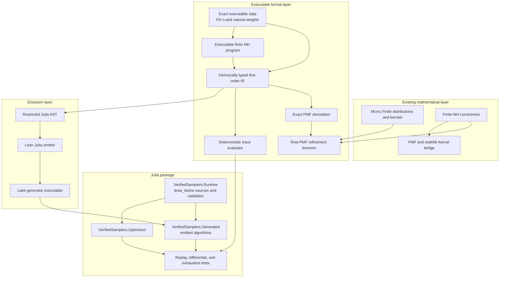

# Executable sampler architecture

## Purpose

This document defines the architecture for connecting the mathematical `Mcmc`
library to executable reference samplers. The first implementation target is
the exact finite Metropolis--Hastings slice specified in the
[finite executable roadmap](finite-executable-roadmap.md), but the boundaries
are chosen so continuous and coupled samplers can be added later without
changing what existing correctness claims mean.

The central rule is that mathematical semantics, deterministic replay, code
emission, and Julia execution are separate layers with explicit interfaces.

## Scope and assurance levels

The executable project uses three assurance descriptions:

1. **Verified mathematical kernel.** Lean proves kernel validity,
   reversibility, invariance, coupling marginals, or other explicitly stated
   properties.
2. **Executable Lean oracle and generated Julia core.** The compiled Lean
   evaluator is the behavioral reference for shared traces. Julia source is
   emitted from Lean, conditional on the documented emitter, runtime, RNG, and
   Julia-toolchain assumptions.
3. **Tested optimized implementation.** Maintained Julia code is compared with
   the reference using trace replay, property tests, numerical comparisons,
   statistical tests, and benchmarks. Testing is evidence, not formal
   equivalence.

The project does not attempt to make arbitrary mathlib measures executable,
translate arbitrary elaborated Lean, verify Julia or BLAS, or initially prove
end-to-end floating-point error bounds. It also does not describe invariance as
convergence or a tested implementation as formally verified.

## Repository ownership

```text
formal/
  Mcmc/                         mathematical and executable Lean library
  Mcmc.lean                     public library surface
  lakefile.toml

VerifiedSamplers.jl/
  src/
    VerifiedSamplers.jl         stable Julia package facade
    Runtime/                    maintained trusted primitive implementations
    Generated/                  compiler-emitted production core
    Optimized/                  maintained optimized implementations
  test/

docs/                           cross-layer specifications and assurance notes
Makefile                        explicit build, generation, and validation entry points
```

Only the Lean emitter writes generated core files under
`VerifiedSamplers.jl/src/Generated/`. Runtime and
optimized sources are maintained by hand. Emitted files carry a do-not-edit
header and are committed so installing the Julia package does not require
Lean.

## Layered dependency graph



Dependencies point downward toward artifacts. Mathematical theorems must not
depend on the Julia AST, printer, runtime, or generated files. The trace and
PMF interpreters are sibling interpretations of the same IR; neither is
defined by executing the other.

## Formal components

### Exact executable data

The finite data layer contains proof-carrying construction inputs, not a new
probability theory:

- a natural-weight vector with positive total mass;
- a target weight vector over `Fin n`;
- one positive-total proposal row for each state; and
- realization functions into the existing real-valued
  `Mcmc.Finite.MarkovKernel.Distribution` and `MarkovKernel` definitions.

Construction proofs are erased at runtime. Values used by execution—state
count, weights, totals, and bounds—remain explicit.

### First-order typed IR

The compiler consumes a small first-order syntax rather than arbitrary Lean
functions. Its initial type universe needs only:

```text
Nat | Bool | FiniteState n | Pair a b | Result error a
```

The initial expression and command forms are:

```text
constants, variables, pairs, projections
natural arithmetic and comparisons
finite vector lookup
let binding and conditionals
statically bounded loops
drawBelow(upper)
explicit failure
```

The IR is intrinsically typed where practical. Dynamic obligations such as a
positive draw bound and an in-range trace result are checked explicitly. It
contains no Julia names, mutation model, hidden RNG, `Float64`, measure values,
or proof witnesses.

Higher-order Lean combinators may make programs convenient to construct, but
they must elaborate into this inspectable first-order IR before denotation or
emission. A continuation-valued sampler that the emitter cannot inspect is not
the compiler input.

### PMF denotation

The denotational interpreter maps a closed program to an exact `PMF` of either
failure or result. `drawBelow(k)` denotes the uniform PMF on values below `k`
when `k > 0` and an explicit error otherwise. Sequencing uses PMF bind.

For a transition program, the semantic endpoint is:

```lean
State -> PMF (Result ExecError State)
```

Well-formed sampler configurations prove that failure has zero mass, yielding
the simpler row PMF used by the refinement theorem.

### Trace evaluator

The trace interpreter is deterministic. A trace event records at least:

```text
primitive kind | requested upper bound | returned value | stream position
```

Evaluation returns a result, the unconsumed trace, and diagnostics, or a typed
error for exhaustion, kind mismatch, invalid bound, or out-of-range value.

A replay theorem relates successful evaluation to the pure control-flow
semantics. A separate enumeration/weighting theorem connects valid primitive
traces to PMF denotation. A concrete trace is not itself treated as a random
sample or probability kernel.

### Executable finite MH

The finite MH constructor builds an IR program from exact target and proposal
weights. At state `x`, it:

1. samples proposal `y` by cumulative proposal weights;
2. computes the exact forward and reverse integer products, including the two
   proposal-row normalization totals;
3. performs an exact integer threshold draw for the zero-safe acceptance
   probability; and
4. returns `y` on acceptance and `x` otherwise.

Self proposals and zero forward or reverse proposal weights are represented
explicitly. In particular, if proposal row `x` has total `Sx`, the acceptance
comparison uses

```text
forward = targetWeight[x] * proposalWeight[x,y] * Sy
reverse = targetWeight[y] * proposalWeight[y,x] * Sx
```

so row-dependent proposal normalizers are not accidentally cancelled. No
floating-point division is used.

The principal theorem is pointwise equality:

```text
denote (finiteMH config) x
  = (Mcmc.Finite.MetropolisHastings.kernel target proposal ...).rowPMF x
```

The existing PMF-to-measure bridge then supplies equality with the established
mathlib kernel. Detailed balance and invariance are inherited from existing
theorems rather than duplicated for executable syntax.

## Emission architecture

### Restricted Julia AST

The emitter targets a Julia AST owned by the project, not raw string fragments.
The AST admits only the declarations, expressions, statements, and calls on a
small allowlist required by the finite IR. Identifier validation and escaping
occur before printing.

Unsupported IR operations or primitive calls produce a generation error. They
must never be emitted as arbitrary trusted Julia calls.

### Generator executable

The finite layer uses a deterministic Lean emitter for the generic natural-
weight categorical and MH algorithms:

```text
typed finite entry descriptor
  -> backend-neutral typed command IR
  -> restricted validated Julia AST
  -> deterministic Julia printer
  -> Generated core files
```

The command IR contains the categorical scan and generic MH control flow,
including validation, proposal, zero-safe integer acceptance, and rejection.
It has no Julia syntax. Julia's one-based indexing is introduced only by the
backend lowering. The restricted AST has no raw-source escape constructor and
rejects identifiers, types, and imports outside its finite allowlist.

Generation uses stable formatting so identical Lean input gives byte-identical
output.

`make generate` invokes the generator. `make check-generated` emits into a
temporary directory and compares it with committed generated sources without
modifying the working tree.

Compiler semantic preservation is a future theorem. Until then, generated
Julia correctness is conditional on the emitter, printer, and runtime contract,
even though the source executable configuration has a proved PMF refinement.

### Canonical-interpreter migration

The current finite layer predates the command IR, so the verified
`replayCategorical` and `replayMHStep` functions and the newer IR temporarily
describe the same control flow separately. This duplication is transitional.
The planned migration is to define deterministic trace semantics for the
command IR, prove those semantics equal to the existing replay functions, and
then make the IR interpreter the canonical executable Lean implementation.
The old independently maintained replay algorithms can then be deprecated;
the compiled Lean oracle will remain, but will execute the IR interpreter.

This architecture also applies to general-state and continuous samplers at the
semantic level, but not by reusing the finite command IR unchanged. A
continuous sampler IR needs ideal primitives whose denotations are mathlib
`Measure` or `ProbabilityTheory.Kernel` objects, such as exact standard-normal
and unit-uniform draws. Its deterministic trace interpreter can use exact real
events, while a Julia backend uses floating-point and concrete RNG operations.
The measure-level sampler theorem can therefore be exact, but connecting it to
actual `Float64` Julia requires a separate numerical/RNG refinement or an
explicit approximation theorem; executable computation cannot in general
enumerate or represent an arbitrary continuous measure exactly.

## Julia package architecture

### Runtime submodule

`VerifiedSamplers.Runtime` is maintained Julia code defining the primitive
interface. The finite milestone requires:

- `RNGSource`, backed by an explicit `AbstractRNG`;
- `TraceSource`, backed by validated predetermined events; and
- `draw_below!(source, upper)`.

The production implementation must document its exact Julia and RNG support.
The generated path uses arbitrary-precision integers or checked conversions;
overflow cannot silently change a probability.

### Generated submodule

`VerifiedSamplers.Generated` contains emitted algorithms and thin module
assembly only. Its functions accept a source explicitly and expose stable
results and diagnostics. They never access Julia's global RNG.

### Optimized submodule

`VerifiedSamplers.Optimized` contains the maintained finite differential
implementation. Its categorical selector uses cumulative sums and binary
search rather than the generated linear scan. It is exhaustively trace-tested
against both the generated core and Lean oracle, but it does not have a
separate machine-checked refinement theorem.

## Assurance and trust matrix

| Boundary | Initial assurance |
|---|---|
| Natural weights to PMF | Proved in Lean |
| Generic categorical PMF denotation | Proved in Lean |
| Generic executable MH to existing row PMF | Proved in Lean |
| Existing finite MH detailed balance/invariance | Already proved in Lean |
| Trace evaluator behavior | Defined and proved in Lean |
| Finite command IR to Julia AST/source | Deterministic, validated, and tested lowering; semantic preservation remains trusted |
| Julia parsing and execution | Julia toolchain assumption |
| Production `draw_below!` distribution | Documented runtime/RNG assumption |
| Julia trace replay against Lean fixtures | Exhaustive finite testing |
| Optimized implementation equivalence | Exhaustive finite trace conformance |

No claim should collapse these rows into “the Julia implementation is fully
verified.” The strongest initial description is that Julia core code is
emitted from a Lean program with a proved finite-kernel denotation, conditional
on the documented emitter and runtime boundaries.

## Language and external implementation policy

Julia is the first backend because its numerical, automatic-differentiation,
and MCMC ecosystem makes it useful both as a readable execution environment
and as a path to practical implementations. The formal IR remains
language-neutral: Julia names and runtime behavior enter only in the emitter
and primitive contracts. A later Rust or other backend should consume the same
validated IR rather than change its PMF semantics.

AdvancedHMC.jl is an API reference, benchmark comparison, and independent
differential-testing target. It is not imported by the generated runtime and
is not the source of mathematical semantics. A match provides corroborating
evidence; a mismatch must be classified as an algorithm, convention,
floating-point, or implementation difference before being called a defect.

Optimized implementations may use mutation, preallocation, BLAS, GPUs, or a
different random-consumption order. They remain at the tested assurance level
unless represented in the formal IR or connected by a separate refinement
proof.

## Adaptation and convergence boundary

Warmup and adaptation are stateful stochastic algorithms, not hidden fields of
a fixed kernel. Step-size and mass-matrix adaptation will require explicit
state transitions and their own mathematical specifications. Initial
executable milestones use fixed parameters.

Matching an invariant fixed-parameter kernel transfers only the properties
proved for that kernel. It does not establish convergence from arbitrary
initial states, mixing rates, or finite-sample estimator guarantees. Those
claims continue to require explicit irreducibility, drift, moment, and mode-of-
convergence assumptions as appropriate.

## Expansion sequence after the finite slice

The intended order after the finite milestone is:

1. continuous Gaussian RWMH with an explicit standard-normal primitive and a
   separate `Float64` boundary;
2. fixed-trajectory endpoint HMC with component-level exact-arithmetic
   refinement and trace diagnostics for every leapfrog state;
3. multinomial HMC and coupled draws with shared-randomness structure; and
4. optimized implementations, adaptation, and additional backends only after
   their theorem and runtime boundaries are fixed.

This sequence is guidance, not a claim that later numerical or convergence
obligations are already discharged.

### Continuous Gaussian RWMH status

The primitive and program boundaries are now concrete.
`Mcmc.Executable.IR` supplies an intrinsically typed first-order syntax with
typed de Bruijn variables, pure expressions, syntactic `let` and `sample`
binders, exact kernel semantics, and deterministic trace semantics. Lean proves
that every program denotes a Markov kernel. The standard-normal law is exactly
mathlib's `volume.withDensity (gaussianPDF 0 1)`.

The first continuous program draws standard-normal noise and translates it by
the current scalar state. Lean proves its measure is `gaussianReal current 1`
and is exactly the corresponding proposal row in the existing density-based
RWMH construction. The current Julia `GaussianRWMH` is maintained under
`Optimized`, consumes explicitly typed `Float64` trace events in tests, and
uses `randn`/`rand` for production draws. Its moment and deterministic replay
tests are implementation evidence only. The complete standard-Gaussian-target
IR program, its accept-or-retain replay theorem, the exact unit-uniform
threshold integral, and pointwise equality with `densityAcceptance` are now
proved. Still required for full continuous RWMH refinement is their final
composition into kernel equality with
`Mcmc.Kernel.randomWalkMetropolisHastings`. The exact assumptions at the Julia
boundary are listed in the [continuous executable contract](continuous-executable-contract.md).

## Validation flow

The root workflow is:

```text
make formal
  compile definitions, interpreters, and refinement proofs

make generate
  emit committed Generated sources explicitly

make check-generated
  check repository freshness by deterministic regeneration and diff

make julia
  run runtime, replay, exhaustive, and package tests

make test
  run all required validation gates
```

The finite milestone is architectural proof that this flow works end to end.
Continuous primitives and floating-point refinement extend the primitive and
numeric boundaries later; they do not replace the finite semantics or weaken
its theorem.
