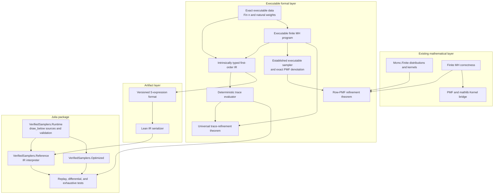

# Executable sampler architecture

## Purpose

This document defines the architecture for connecting the mathematical `Mcmc`
library to executable reference samplers. The first implementation target is
the exact finite Metropolis--Hastings slice specified in the
[finite executable roadmap](finite-executable-roadmap.md), but the boundaries
are chosen so continuous and coupled samplers can be added later without
changing what existing correctness claims mean.

The central rule is that mathematical semantics, deterministic replay,
artifact serialization, and Julia execution are separate layers with explicit
interfaces.

## Scope and assurance levels

The executable project uses three assurance descriptions:

1. **Verified mathematical kernel.** Lean proves kernel validity,
   reversibility, invariance, coupling marginals, or other explicitly stated
   properties.
2. **Canonical IR and interpreted Julia reference.** The compiled Lean
   evaluator is the behavioral reference for shared traces. Lean emits a
   versioned IR data artifact consumed by a maintained Julia interpreter,
   conditional on the documented serializer, interpreter, runtime, RNG, and
   Julia-toolchain assumptions.
3. **Tested optimized implementation.** Maintained Julia code is compared with
   the reference using trace replay, property tests, numerical comparisons,
   statistical tests, and benchmarks. Testing is evidence, not formal
   equivalence.

The project does not attempt to make arbitrary mathlib measures executable,
translate arbitrary elaborated Lean, verify Julia or BLAS, or initially prove
end-to-end floating-point error bounds. It also does not describe invariance as
convergence or a tested implementation as formally verified.

## Repository ownership

```text
formal/
  Mcmc/                         mathematical and executable Lean library
  Mcmc.lean                     public library surface
  lakefile.toml

VerifiedSamplers.jl/
  src/
    VerifiedSamplers.jl         stable Julia package facade
    Runtime/                    maintained trusted primitive implementations
    Reference/                  maintained interpreter plus emitted IR data
    Optimized/                  maintained optimized implementations
  test/

docs/                           cross-layer specifications and assurance notes
Makefile                        explicit build, generation, and validation entry points
```

Only the Lean serializer writes `VerifiedSamplers.jl/src/Reference/Samplers.ir`.
The Julia interpreter, runtime, and optimized sources are maintained by hand.
The IR artifact is committed so installing the Julia package does not require
Lean.

## Layered dependency graph



Dependencies point downward toward artifacts. Mathematical theorems must not
depend on the serializer, Julia interpreter, runtime, or emitted files. The
command-IR interpreter is proved equal to the established replay semantics;
the existing executable sampler layer separately carries the exact PMF
refinement. The documentation does not invent a command-IR PMF interpreter.

## Formal components

### Exact executable data

The finite data layer contains proof-carrying construction inputs, not a new
probability theory:

- a natural-weight vector with positive total mass;
- a target weight vector over `Fin n`;
- one positive-total proposal row for each state; and
- realization functions into the existing real-valued
  `Mcmc.Finite.MarkovKernel.Distribution` and `MarkovKernel` definitions.

Construction proofs are erased at runtime. Values used by execution—state
count, weights, totals, and bounds—remain explicit.

### First-order typed IR

The serializer consumes a small first-order command syntax rather than
arbitrary Lean functions. The finite command IR has the types:

```text
Source | Nat | Bool | NatVector | NatMatrix
```

Its current programs use:

```text
variables and natural literals
natural multiplication, minimum, totals, comparisons, vector lookup, row lookup
categorical(source, weights)
let binding, conditionals, drawBelow(source, upper), and return
```

Expressions and variables are indexed by their IR types. Valid finite
configurations are constructed with proofs on the Lean side; Julia wrappers
check dimensions, positivity, and state bounds before entering the algorithm
core. Every random primitive still checks its requested bound and trace value.
The IR contains no Julia syntax, hidden RNG, `Float64`, measure values, or proof
witnesses.

Higher-order Lean definitions may help construct programs, but the committed
artifact contains only this inspectable first-order IR.

### Exact PMF semantics

The exact PMF semantics lives in the established executable sampler layer,
not in a second interpreter for the command IR. A positive bounded-natural
draw has a uniform `PMF`; cumulative categorical selection and the generic MH
proposal/accept/reject construction are composed from those PMFs.

For finite MH, the semantic endpoint is:

```lean
stepPMF target proposal : Fin n -> PMF (Fin n)
```

Lean proves this equals the row PMF of the existing verified finite MH kernel.
The command-IR interpreter is connected to the same algorithm by universal
trace refinement to `replayCategorical` and `replayMHStep`.

### Trace evaluator

The finite trace interpreter is deterministic. A trace event records:

```text
requested upper bound | returned value
```

Evaluation returns a result and the unconsumed trace, or a typed error for
exhaustion, bound mismatch, invalid bound, or an out-of-range value.

Universal theorems relate command-IR evaluation—including failures and the
remaining trace—to the established replay specifications. The exact PMF
theorems are proved separately for the corresponding weighted sampler
construction. A concrete trace is not itself treated as a probability kernel.

### Executable finite MH

The finite MH constructor builds an IR program from exact target and proposal
weights. At state `x`, it:

1. samples proposal `y` by cumulative proposal weights;
2. computes the exact forward and reverse integer products, including the two
   proposal-row normalization totals;
3. performs an exact integer threshold draw for the zero-safe acceptance
   probability; and
4. returns `y` on acceptance and `x` otherwise.

Self proposals and zero forward or reverse proposal weights are represented
explicitly. In particular, if proposal row `x` has total `Sx`, the acceptance
comparison uses

```text
forward = targetWeight[x] * proposalWeight[x,y] * Sy
reverse = targetWeight[y] * proposalWeight[y,x] * Sx
```

so row-dependent proposal normalizers are not accidentally cancelled. No
floating-point division is used.

The principal PMF theorem is pointwise equality:

```text
stepPMF target proposal x
  = (Mcmc.Finite.MetropolisHastings.kernel target proposal ...).rowPMF x
```

The canonical command-IR theorem is pointwise equality of deterministic
execution with `replayMHStep` for every valid configuration and input trace.

The existing PMF-to-measure bridge then supplies equality with the established
mathlib kernel. Detailed balance and invariance are inherited from existing
theorems rather than duplicated for executable syntax.

## Artifact and interpretation architecture

The finite layer serializes programs as data rather than generating Julia
algorithm source:

```text
typed finite entry descriptor
  -> backend-neutral typed command IR
  -> versioned S-expression artifact
  -> maintained Julia Reference interpreter
```

The command IR contains a verified categorical primitive and the generic MH
algorithm core: proposal, zero-safe integer acceptance, and rejection. Lean
constructs it from proof-carrying configurations. The Julia reference wrappers
validate raw dimensions, positivity, indices, and integer inputs before
invoking the same core. The maintained interpreters implement the categorical
primitive with a linear cumulative scan.
It has no Julia syntax. Julia's one-based indexing is confined to the
maintained interpreter.

Serialization uses stable formatting so identical Lean input gives byte-identical
output.

`make generate` invokes the serializer. `make check-generated` emits into a
temporary file and compares it with the committed IR artifact without
modifying the working tree.

Cross-language semantic preservation is a future theorem. Until then, Julia
correctness is conditional on the serializer, parser/interpreter, and runtime contract,
even though the source executable configuration has a proved PMF refinement.

### Canonical interpreter

The finite command IR now has deterministic Lean trace semantics. Universal
theorems prove its categorical primitive and generic MH program equal to the
established `replayCategorical` and `replayMHStep` semantics for every valid
configuration and trace, including identical remaining traces and primitive
errors. The compiled Lean oracle and Julia reference path both execute the IR;
the replay definitions remain semantic specifications rather than a second
public execution path.

This architecture also applies to general-state and continuous samplers at the
semantic level, but not by reusing the finite command IR unchanged. A
continuous sampler IR needs ideal primitives whose denotations are mathlib
`Measure` or `ProbabilityTheory.Kernel` objects, such as exact standard-normal
and unit-uniform draws. Its deterministic trace interpreter can use exact real
events, while a Julia backend uses floating-point and concrete RNG operations.
The measure-level sampler theorem can therefore be exact, but connecting it to
actual `Float64` Julia requires a separate numerical/RNG refinement or an
explicit approximation theorem; executable computation cannot in general
enumerate or represent an arbitrary continuous measure exactly.

## Julia package architecture

### Runtime submodule

`VerifiedSamplers.Runtime` is maintained Julia code defining the primitive
interface. The finite milestone requires:

- `RNGSource`, backed by an explicit `AbstractRNG`;
- `TraceSource`, backed by validated predetermined events; and
- `draw_below!(source, upper)`.

The production implementation must document its exact Julia and RNG support.
The reference path uses arbitrary-precision integers or checked conversions;
overflow cannot silently change a probability.

### Reference submodule

`VerifiedSamplers.Reference` contains the maintained generic interpreter and
the emitted, versioned `Samplers.ir` artifact. Its functions accept a source
explicitly and never access Julia's global RNG.

### Optimized submodule

`VerifiedSamplers.Optimized` contains the maintained finite differential
implementation. Its categorical selector uses cumulative sums and binary
search rather than the reference interpreter's linear scan. It is exhaustively trace-tested
against both the reference interpreter and Lean oracle, but it does not have a
separate machine-checked refinement theorem.

## Assurance and trust matrix

| Boundary | Initial assurance |
|---|---|
| Natural weights to PMF | Proved in Lean |
| Generic categorical PMF denotation | Proved in Lean |
| Generic executable MH to existing row PMF | Proved in Lean |
| Existing finite MH detailed balance/invariance | Already proved in Lean |
| Trace evaluator behavior | Defined and proved in Lean |
| Lean IR serialization | Deterministic, versioned, freshness-tested artifact |
| Julia Reference parser/interpreter | Maintained and exhaustively trace-tested; semantic preservation remains trusted |
| Julia parsing and execution | Julia toolchain assumption |
| Production `draw_below!` distribution | Documented runtime/RNG assumption |
| Julia trace replay against Lean fixtures | Exhaustive finite testing |
| Optimized implementation equivalence | Exhaustive finite trace conformance |

No claim should collapse these rows into “the Julia implementation is fully
verified.” The strongest initial description is that Julia Reference
interprets an artifact emitted from a Lean program with a proved finite-kernel
denotation, conditional on the documented interpreter and runtime boundaries.

## Language and external implementation policy

Julia is the first backend because its numerical, automatic-differentiation,
and MCMC ecosystem makes it useful both as a readable execution environment
and as a path to practical implementations. The formal IR remains
language-neutral: Julia names and runtime behavior enter only in the interpreter
and primitive contracts. A later Rust or other backend should consume the same
validated IR rather than change its PMF semantics.

AdvancedHMC.jl is an API reference, benchmark comparison, and independent
differential-testing target. It is not imported by the reference runtime and
is not the source of mathematical semantics. A match provides corroborating
evidence; a mismatch must be classified as an algorithm, convention,
floating-point, or implementation difference before being called a defect.

Optimized implementations may use mutation, preallocation, BLAS, GPUs, or a
different random-consumption order. They remain at the tested assurance level
unless represented in the formal IR or connected by a separate refinement
proof.

## Adaptation and convergence boundary

Warmup and adaptation are stateful stochastic algorithms, not hidden fields of
a fixed kernel. Step-size and mass-matrix adaptation will require explicit
state transitions and their own mathematical specifications. Initial
executable milestones use fixed parameters.

Matching an invariant fixed-parameter kernel transfers only the properties
proved for that kernel. It does not establish convergence from arbitrary
initial states, mixing rates, or finite-sample estimator guarantees. Those
claims continue to require explicit irreducibility, drift, moment, and mode-of-
convergence assumptions as appropriate.

## Expansion sequence after the finite slice

The original intended order after the finite milestone was:

1. continuous Gaussian RWMH with an explicit standard-normal primitive and a
   separate `Float64` boundary;
2. fixed-trajectory endpoint HMC with component-level exact-arithmetic
   refinement and trace diagnostics for every leapfrog state;
3. multinomial HMC and coupled draws with shared-randomness structure; and
4. optimized implementations, adaptation, and additional backends only after
   their theorem and runtime boundaries are fixed.

Items 1 and 2 are complete, and single-chain randomized-origin multinomial HMC
from item 3 is now executable. Coupled shared-randomness commands remain. The
current priorities and assurance boundaries are maintained in the
[executable roadmap](executable-roadmap.md).

### Continuous Gaussian RWMH status

The primitive and program boundaries are now concrete.
`Mcmc.Executable.IR` supplies an intrinsically typed first-order syntax with
typed de Bruijn variables, pure expressions, syntactic `let` and `sample`
binders, exact kernel semantics, and deterministic trace semantics. Lean proves
that every program denotes a Markov kernel. The standard-normal law is exactly
mathlib's `volume.withDensity (gaussianPDF 0 1)`.

The initial unit-scale standard-Gaussian specialization established the
primitive laws, exact unit-uniform threshold integral, and complete
accept-or-retain construction. The current theorem surface is generic over a
scalar real log density and proposal scale:

- deterministic replay is proved for every log-density function and real
  scale;
- the scaled standard-normal law is exactly the corresponding Gaussian
  proposal row;
- for measurable log densities and positive scales, the command program's
  exact kernel equals the verified Gaussian
  `Mcmc.Kernel.randomWalkMetropolisHastings` kernel; and
- the `exp ∘ logDensity` target is invariant, and is a stationary probability
  measure when explicitly normalized.

The version-10 artifact retains this named-variable program with explicit
source, log-density, scale, and current inputs, alongside endpoint,
constant-metric, and multinomial HMC commands. Julia Reference interprets it
and the public `GaussianRWMH` path uses Reference. Optimized remains an
independent Float64 differential target. Both use typed trace events in tests
and `randn`/`rand` for production draws; this is implementation evidence, not
a numerical-refinement theorem. The exact Julia boundary is listed in the
[continuous executable contract](continuous-executable-contract.md).

### Xu et al. coupled command status

IR version 9 adds named commands for shared-momentum multinomial HMC, sticky
Gaussian RWMH, and their mixture. Their ideal Lean denotations reuse the
verified coupled kernels rather than defining parallel mathematics. Lean
proves the HMC, RWMH, and mixture marginal identities.

Julia Reference implements the associated shared randomness and reports exact
state equality as a replay-level meeting flag. This adds executable access and
implementation tests, not a proof that Float64 replay denotes the ideal-real
coupled kernel. That edge remains part of the numerical-refinement boundary.

## Validation flow

The root workflow is:

```text
make formal
  compile definitions, interpreters, and refinement proofs

make generate
  emit the committed versioned IR artifact explicitly

make check-generated
  check repository freshness by deterministic regeneration and diff

make julia
  run runtime, replay, exhaustive, and package tests

make test
  run all required validation gates
```

The finite milestone is architectural proof that this flow works end to end.
Continuous primitives and floating-point refinement extend the primitive and
numeric boundaries later; they do not replace the finite semantics or weaken
its theorem.
