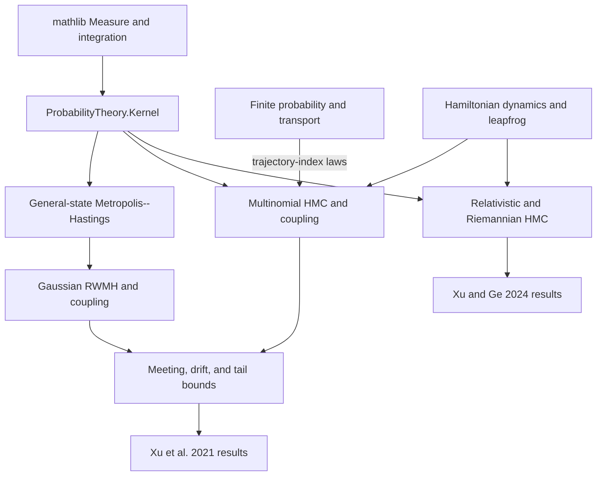
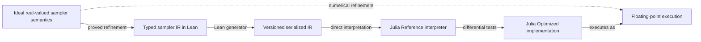

# Lean-generated architecture graphs

<!-- Generated by formal/Mcmc/GenerateDocs.lean; do not edit manually. -->

The graph data below is defined and typechecked in `Mcmc.Docs.Graph`.

## Formalization dependency graph

Arrows show definition or theorem dependencies. The finite layer remains useful inside general-state HMC because trajectory-index selection is finite.

## Executable assurance graph

Solid arrows are implemented generation, proved refinement, or tested conformance links as labeled. The dashed numerical-refinement arrow is an explicit deferred proof obligation, not a theorem.
