# Related work

This note records related work for the formalization of Markov chain Monte
Carlo algorithms in Lean. It is a literature map, not a claim of novelty. The
search was last updated on 2026-08-15 and covered mathlib documentation,
Isabelle's Archive of Formal Proofs, Rocq/MathComp sources, conference papers,
arXiv, and public GitHub code.

For a broader, paper-by-paper map of foundational and high-impact MCMC/HMC
algorithms, theorem-strength boundaries, repository fit, and formalization
priority, see the [algorithm scope review](algorithm-scope-review.md). It
includes Gibbs, MALA, adaptive and reversible-jump MCMC, pseudo-marginal and
particle MCMC, NUTS, slice sampling, tempering, nonreversible PDMP samplers,
coupled unbiased estimators, and sequence-parallel MCMC evaluation.

## Summary

No substantive, public, machine-checked formalization of the
Metropolis--Hastings (MH) algorithm in Lean was found in this search. There is,
however, closely related work in three categories:

1. mathematical correctness proofs for MH and trace MCMC;
2. mechanized foundations for Markov chains, stochastic matrices, and
   probability kernels; and
3. verified probabilistic-program samplers that are not themselves MCMC
   formalizations.

This negative search result should be stated cautiously: it is evidence of a
gap in the public literature surveyed here, not proof that no formalization
exists.

## Formalization dependency graph

The graph below is a dependency map for repository coverage, not a citation
network or chronology. An arrow `A --> B` means that a useful formalization of
`B` depends on definitions or theorems from `A`. Dotted arrows are execution or
numerical-refinement dependencies rather than mathematical kernel-correctness
dependencies. Green nodes are substantially covered now, blue nodes are the
recommended reusable next layer, and unfilled nodes are later branches.

```mermaid
flowchart TB
  finite["Finite distributions and kernels"]
  measure["Measure, integration, and general-state kernels"]
  paths["Path laws and stochastic-process semantics"]

  mh["MH accepted flow, detailed balance, stationarity<br/>Metropolis 1953; Hastings 1970"]
  comb["Kernel composition, mixtures, products,<br/>coordinate lifts, and marginals"]
  erg["Irreducibility, aperiodicity, Harris recurrence,<br/>minorization, drift, and convergence"]
  aux["Extended-state kernels and marginalization"]

  gibbs["Gibbs and annealing<br/>Geman and Geman 1984"]
  temper["Parallel tempering<br/>Geyer 1991"]
  tierney["General-state convergence spine<br/>Tierney 1994"]
  mala["MALA; biased ULA kept separate<br/>Roberts and Tweedie 1996"]
  adapt["Adaptive MCMC<br/>Roberts and Rosenthal 2007"]
  rj["Reversible-jump MCMC<br/>Green 1995"]
  pm["Pseudo-marginal MH<br/>Andrieu and Roberts 2009"]
  smc["Feynman--Kac and SMC semantics"]
  pmcmc["Particle MCMC<br/>Andrieu, Doucet, and Holenstein 2010"]
  slice["Slice sampling<br/>Neal 2003"]

  det["Reversible measure-preserving<br/>deterministic proposals"]
  dyn["Hamiltonian dynamics, leapfrog,<br/>energy, and momentum refresh"]
  hmc["Corrected and multinomial HMC<br/>Duane et al. 1987; Neal 2011"]
  nuts["NUTS candidate trees<br/>Hoffman and Gelman 2014"]
  rhmc["Manifold and relativistic HMC<br/>Girolami and Calderhead 2011; Xu and Ge 2024"]
  energy["Energy-error identities and scaling<br/>Beskos et al. 2013; Bou-Rabee and Sanz-Serna 2018"]

  coupling["Coupled kernels with proved marginals"]
  meeting["Faithful meeting, tail bounds,<br/>and telescoping estimators"]
  unbiased["Unbiased coupled MCMC<br/>Jacob, O'Leary, and Atchade 2020"]
  xu21["Coupled multinomial HMC<br/>Xu et al. 2021"]

  ct["Continuous-time PDMP construction,<br/>generators, events, and nonexplosion"]
  thinning["Poisson thinning and certified rate bounds"]
  bps["Bouncy particle sampler<br/>Bouchard-Cote, Vollmer, and Doucet 2018"]
  zigzag["Zig-Zag and exact subsampling<br/>Bierkens, Fearnhead, and Roberts 2019"]

  traces["Seeded deterministic transition<br/>and trace semantics"]
  scans["Causal recurrences and associative scans"]
  parallel["Sequence-parallel MCMC evaluation<br/>Zoltowski et al. 2025"]
  numeric["Floating-point and stopping certificates"]

  finite --> mh
  measure --> mh
  finite --> comb
  measure --> comb
  paths --> erg
  measure --> erg
  mh --> comb
  mh --> tierney
  erg --> tierney

  comb --> gibbs
  erg --> gibbs
  comb --> temper
  mh --> temper
  mh --> mala
  erg --> mala
  comb --> adapt
  erg --> adapt
  mh --> rj

  mh --> aux
  comb --> aux
  aux --> pm
  smc --> pmcmc
  pm --> pmcmc
  aux --> slice

  measure --> det
  det --> hmc
  dyn --> hmc
  comb --> hmc
  hmc --> nuts
  hmc --> rhmc
  dyn --> rhmc
  hmc --> energy
  dyn --> energy

  comb --> coupling
  coupling --> meeting
  paths --> meeting
  erg --> meeting
  meeting --> unbiased
  hmc --> xu21
  meeting --> xu21

  measure --> ct
  paths --> ct
  ct --> thinning
  ct --> bps
  erg --> bps
  ct --> zigzag
  thinning --> zigzag
  erg --> zigzag

  gibbs -.-> traces
  mala -.-> traces
  hmc -.-> traces
  traces -.-> scans
  scans -.-> parallel
  numeric -.-> parallel

  classDef covered fill:#d9f2df,stroke:#26733a,color:#111;
  classDef next fill:#dcecff,stroke:#2867a8,color:#111;
  class finite,measure,mh,det,dyn,hmc,coupling,meeting,unbiased,xu21,rhmc covered;
  class comb,erg,aux,gibbs,temper,pm,mala,traces next;
```

The central reusable route is deliberately short:
`kernel combinators -> Gibbs/tempering`, `extended-state MH ->
pseudo-marginal -> particle MCMC`, and `corrected HMC -> NUTS/manifold HMC`.
Adaptive MCMC and PDMP samplers require genuinely different nonhomogeneous or
continuous-time semantics. Sequence-parallel evaluation sits downstream of a
proved sequential transition: it refines how a seeded path is evaluated and
does not replace the sampler's invariance or convergence proof.

The repository now starts that distinct continuous-time branch with
`Mcmc.PDMP.Generator`: it defines generator invariance on an explicit test
class, proves rate-biased jump-flux expectation balance, and proves the finite
reversible-rate generator identity. The `ct` node above is still not marked
covered because construction of the continuous-time path law, event clocks,
nonexplosion, and semigroup invariance remain separate obligations.

## Direct mathematical precedents

### MCMC using Hamiltonian dynamics

Neal's review gives the classical endpoint-Metropolis HMC construction and
surveys partial momentum refreshment, windowed acceptance, approximate
trajectory computation, short-cut trajectories, and tempering. It explicitly
separates invariance of the basic transition from ergodicity, noting periodic
parameter choices for which ergodicity fails.

- Radford M. Neal, [MCMC using Hamiltonian
  dynamics](https://arxiv.org/abs/1206.1901), in *Handbook of Markov Chain
  Monte Carlo*, 2011; arXiv version 2012.

The review motivates the generic invariant-momentum-transition layer and
clarifies which variants need additional kernels or symmetry proofs. The
mapping is recorded in the [foundation coverage note](neal12-coverage.md).

### A conceptual introduction to Hamiltonian Monte Carlo

Betancourt presents HMC as an auxiliary-variable transition: lift a position
to phase space with a momentum distribution, evolve along Hamiltonian
trajectories, and project back. The review also explains why symplectic
integrators and a trajectory-level correction are central to practical HMC,
while explicitly prioritizing intuition over exhaustive technical rigor.

- Michael Betancourt, [A Conceptual Introduction to Hamiltonian Monte
  Carlo](https://arxiv.org/abs/1701.02434), 2017, revised 2018.

This decomposition motivates the repository's generic
`liftEvolveProject_invariant` theorem. The exact mapping, implemented pieces,
and convergence boundary are recorded in the [foundation coverage
note](betancourt17-coverage.md).

### Couplings for multinomial Hamiltonian Monte Carlo

Xu, Fjelde, Sutton, and Ge construct maximal and transport-based couplings for
multinomial HMC and prove geometric tails for the meeting time of a mixture
with coupled random-walk Metropolis--Hastings. Their proof proceeds through
local contractivity under a globally Lipschitz gradient and local strong
convexity, a total-variation estimate for multinomial trajectory weights, and
drift/small-set results adapted from Heng and Jacob. This paper is the primary
coupling and meeting-time target of the repository.

- Kai Xu, Tor Erlend Fjelde, Charles Sutton, and Hong Ge,
  [Couplings for Multinomial Hamiltonian Monte Carlo](https://proceedings.mlr.press/v130/xu21i.html),
  AISTATS 2021. The proceedings page includes the paper and supplementary
  proofs.

Formalizing its main results requires more than target invariance: coupled
kernels with correct marginals, Hamiltonian and leapfrog analysis, categorical
maximal and optimal-transport couplings, drift conditions, and a geometric
meeting-time theorem must all be connected explicitly.

The formalization exposes a zero-time quantifier obstruction in printed
Condition 1 and a separate obstruction to the broad unconditional
exponent-two route. The canonical statements, repairs, implications, and Lean
artifacts are recorded in the [2021 coverage audit](xu21-coverage.md).

### Riemann manifold Hamiltonian Monte Carlo

Girolami and Calderhead introduce classical RMHMC with the conditional
Gaussian momentum law `p | q ~ N(0, G(q))`, the corresponding nonseparable
Hamiltonian, and an implicit generalized-leapfrog proposal. Their correctness
argument depends on solving that integrator exactly enough to retain
reversibility and volume preservation, followed by Metropolis correction.

- Mark Girolami and Ben Calderhead,
  [Riemann manifold Langevin and Hamiltonian Monte Carlo methods](https://doi.org/10.1111/j.1467-9868.2010.00765.x),
  JRSS B, 2011.

The machine-checked core establishes the Gaussian transport/determinant
identity, phase reversibility and invariance, and projected position
invariance. The paper's general use of “ergodic” and “convergence” requires
additional irreducibility and recurrence assumptions; these do not follow
from detailed balance alone. The exact claims and implementation boundary are
recorded in the [classical RMHMC coverage audit](classical-rmhmc-coverage.md).

#### Position-dependent and manifold MALA

Girolami and Calderhead also derive a manifold Langevin proposal with
position-dependent covariance. Xifara, Sherlock, Livingstone, Byrne, and
Girolami later identify a missing factor of one half and clarify that the
original diffusion's density is naturally expressed relative to Riemannian
volume, not ordinary Lebesgue measure. For a Lebesgue-density target they
propose position-dependent MALA (PMALA), whose drift adds half the row
divergence of the inverse metric.

- Tatiana Xifara, Chris Sherlock, Samuel Livingstone, Simon Byrne, and Mark
  Girolami, [Langevin diffusions and the Metropolis-adjusted Langevin
  algorithm](https://arxiv.org/abs/1309.2983), 2014.

This distinction affects diffusion interpretation, not the generic MH fact:
a simplified position-dependent Gaussian proposal still defines an invariant
MH kernel when its actual forward and reverse densities are used. The project
therefore treats Lebesgue-correct PMALA as the primary geometric Langevin
method and simplified MMALA as a labelled control. The fixed-probe dense and
low-rank metric plan is recorded in the
[position-dependent MALA idea note](https://github.com/xukai92/mcmc-lean/blob/main/algo-seek/idea-position-dependent-mala.md).

#### Statistically sensed position-dependent metrics

A possible structured-metric direction combines RMHMC with randomized
curvature sensing under a fixed pass budget. Given `M` extra Hessian-vector,
Fisher-vector, or generalized Gauss--Newton-vector products per metric
evaluation, their outer products define a local ridge-plus-rank-`M` metric.
The represented matrix has dense entries and captures rotated curvature, but
Woodbury and determinant identities avoid dense factorization. A diagonal
probe estimate is retained only as a baseline. Fisher/GGN geometry supplies a
positive-semidefinite source in many statistical models; randomized range
finding and Krylov methods supply the repeated-pass linear-algebra precedent.

These ingredients do not by themselves prove a new sampler correct. A probe
estimate used as `G(q)` must remain a smooth, strictly positive-definite
function of position, and its inverse, log determinant, and metric force must
be derived consistently. Probe randomness must be fixed during a reversible
proposal or included in an extended state. By contrast, curvature accumulated
during warmup and then frozen gives global preconditioned HMC rather than
position-dependent RMHMC.

The candidate design and its relationship to RMHMC, Fisher/GGN metrics,
randomized numerical linear algebra, and auxiliary-variable MCMC are recorded
in the [statistical-curvature RMHMC idea
note](https://github.com/xukai92/mcmc-lean/blob/main/algo-seek/idea-statistical-curvature-rmhmc.md).
The combination is a
research direction, not presently a novelty claim or a covered theorem.

#### Transport maps and likelihood-informed subspaces

Transport-map MCMC learns an invertible coordinate change that makes a target
easier for a conventional transition; Parno and Marzouk retain exactness with
Metropolis correction, while NeuTra HMC runs HMC after a learned neural
transport. Likelihood-informed methods instead identify directions in which a
likelihood substantially changes a Gaussian reference measure and spend more
proposal effort in that subspace. A linear subspace does not itself straighten
curved geometry, while a general transport has a larger learning and Jacobian
cost.

This repository implements fixed-map transport HMC first. The map is frozen
during retained sampling, and the Lean theorem exposes the exact pushforward
identity in which the Jacobian belongs. It also implements a fixed-basis
likelihood-informed client: conditional HMC acts in the active subspace and an
MH-corrected pCN move acts in the Gaussian-reference complement. Its Lean
surface currently proves conditional common-target composition; concrete
component clients remain open. Online adaptation is not silently included in
either stationary kernel.
See the [algorithm note](https://github.com/xukai92/mcmc-lean/blob/main/algo-seek/idea-transport-and-subspace-hmc.md).

#### Parallel coupled unbiased MCMC

Coupled unbiased estimators are independently replicable, but random meeting
times create variance, straggler, and completion-bias concerns. Parallelism
inside target evaluation or between marginal chains does not by itself change
the estimator law; cancelling, restarting, selecting, or weighting replicates
according to observed completion can. Parallelizing the time direction of an
HMC trajectory additionally needs a proposal-level correctness argument
because ordinary leapfrog is sequential.

The [parallel coupled-MCMC idea
note](https://github.com/xukai92/mcmc-lean/blob/main/algo-seek/idea-parallel-coupled-unbiased-mcmc.md)
records the relationship to unbiased MCMC, coupled HMC, multinomial-HMC
couplings, parallel-in-sequence MCMC, and a proposed malleable scheduler. It is
a research plan, not a proved scheduler or a novelty claim.

### Practical Hamiltonian Monte Carlo on Riemannian manifolds

Xu and Ge introduce general-relativistic HMC (GR-HMC), combining a
position-dependent Riemannian metric with relativistic momentum to obtain a
position-dependent velocity bound.  They derive a generalized Hamiltonian,
implicit generalized-leapfrog updates, efficient derivative expressions, and
a proposed multivariate momentum sampler.

- Kai Xu and Hong Ge,
  [Practical Hamiltonian Monte Carlo on Riemannian Manifolds via Relativity
  Theory](https://proceedings.mlr.press/v235/xu24i.html), ICML 2024.

The validity discussion is informal, and formalization exposes corrections to
the dimension-dependent momentum sampler, affine transport, and Equation (9),
plus an obstruction to treating six fixed-point iterations as an exact
integrator. The canonical statements, corrected formulas, implications, and
Lean artifacts are recorded in the [2024 coverage audit](xu24-coverage.md).

### Turing: composable probabilistic inference

Ge, Xu, and Ghahramani present Turing's probabilistic-programming interface
and emphasize composition of MCMC operators on manually chosen, potentially
overlapping variable subsets, especially particle Gibbs for latent variables
with HMC or NUTS for differentiable variables.

- Hong Ge, Kai Xu, and Zoubin Ghahramani,
  [Turing: A Language for Flexible Probabilistic Inference](https://proceedings.mlr.press/v84/ge18b.html),
  AISTATS 2018.

This is primarily a systems and empirical paper. The reusable mathematical
claim is common-target stationarity under composition of full-state component
kernels; implementation and performance claims require separate executable
evidence. The exact classification and repository mapping are in the
[2018 coverage audit](ge18-coverage.md).

### A categorical account of Metropolis--Hastings

Cornish and Wang give an abstract account of MH in Markov categories. They
formulate invariance and reversibility categorically and derive necessary and
sufficient conditions under which general MH-type samplers are reversible.
This is probably the closest conceptual precedent for a future abstract Lean
interface, especially for involutive variants of MH. The publication page does
not list a proof-assistant development.

- Robert Cornish and Yuyang Wang, [A Categorical Account of the
  Metropolis-Hastings Algorithm](https://drops.dagstuhl.de/entities/document/10.4230/LIPIcs.LICS.2026.32),
  LICS 2026.

### Correct samplers for probabilistic programs

Hur, Nori, Rajamani, and Samuel prove correctness of an MCMC sampler for
probabilistic programs, including the bookkeeping required when executions
have changing sets of random choices. This is an algorithmic correctness
precedent, but the published result is a conventional mathematical proof
rather than a machine-checked artifact.

- Chung-Kil Hur, Aditya Nori, Sriram Rajamani, and Selva Samuel,
  [A Provably Correct Sampler for Probabilistic
  Programs](https://drops.dagstuhl.de/entities/document/10.4230/LIPIcs.FSTTCS.2015.475),
  FSTTCS 2015.

Borgström, Dal Lago, Gordon, and Szymczak formalize trace MCMC for a
probabilistic lambda calculus. Their paper proves properties including
irreducibility and aperiodicity and then establishes convergence in total
variation to the target semantics. This is especially relevant when the
project moves beyond stationarity to convergence.

- Johannes Borgström, Ugo Dal Lago, Andrew D. Gordon, and Marcin Szymczak,
  [A Lambda-Calculus Foundation for Universal Probabilistic
  Programming](https://andrewdgordon.github.io/papers/lambda-calculus-foundation-universal-probabilistic-programming.pdf),
  ICFP 2016.

Ścibior and collaborators develop denotational semantics for higher-order
Bayesian inference using quasi-Borel spaces. Their validation includes a
general Metropolis--Hastings--Green result and trace-MH validity. It provides a
useful mathematical reference for a later general-state development involving
measures and Radon--Nikodym derivatives.

- Adam Ścibior et al., [Denotational Validation of Higher-Order Bayesian
  Inference](https://www.cs.ox.ac.uk/people/samuel.staton/papers/popl2018.pdf),
  POPL 2018.

## Mechanized foundations

### Lean and mathlib

Mathlib already has the measure-theoretic concepts that should eventually
receive the finite construction in this repository:

- [`ProbabilityTheory.Kernel.Invariant` and
  `ProbabilityTheory.Kernel.IsReversible`](https://leanprover-community.github.io/mathlib4_docs/Mathlib/Probability/Kernel/Invariance.html),
  including the generic implication from reversibility to invariance;
- [irreducibility of probability
  kernels](https://leanprover-community.github.io/mathlib4_docs/Mathlib/Probability/Kernel/Irreducible.html),
  expressed using positivity of iterated kernels; and
- the general [kernel definitions and
  constructions](https://leanprover-community.github.io/mathlib4_docs/Mathlib/Probability/Kernel/Defs.html).

Etienne Marion's formalization of the Ionescu--Tulcea theorem constructs the
law of an infinite Markov trajectory in mathlib. It supplies relevant
infrastructure for reasoning about a chain as a stochastic process rather
than only about its one-step transition kernel.

- Etienne Marion, [A Formalization of the Ionescu--Tulcea Theorem in
  Mathlib](https://arxiv.org/abs/2506.18616), 2025.

The current finite interface deliberately proves the elementary algebra
directly. It overlaps with the concepts above but not with an existing Lean MH
correctness theorem found by this search. A bridge from the finite interface
to `ProbabilityTheory.Kernel` would let later results reuse mathlib's general
theory.

### Isabelle/HOL

The Isabelle Archive of Formal Proofs contains substantial Markov-chain
infrastructure, although the surveyed entries do not formalize MH itself:

- Hölzl and Nipkow's [Markov
  Models](https://isa-afp.org/entries/Markov_Models.html) develops discrete-time
  Markov chains, Markov decision processes, and classification of states.
- Thiemann's [Stochastic Matrices and the Perron--Frobenius
  Theorem](https://isa-afp.org/entries/Stochastic_Matrices.html) treats
  finite-state stochastic matrices and proves existence of stationary
  distributions and uniqueness under irreducibility.

These developments are close precedents for the finite algebraic layer and
for a future finite-state convergence theorem.

### Rocq/Coq

MathComp Analysis mechanizes measure theory for kernels, including s-finite
kernels used in semantics of probabilistic programs. It is relevant to the
architecture of a general-state formalization but does not provide an MH
correctness theorem.

- Affeldt, Cohen, and Saito, [`kernel.v` in MathComp
  Analysis](https://github.com/math-comp/analysis/blob/master/theories/kernel.v).

Bagnall, Stewart, and Banerjee's Zar compiler is a fully verified Coq pipeline
from probabilistic programs with loops and conditioning to executable
random-bit samplers. It is a useful precedent for end-to-end implementation
correctness and extraction, but it is not an MCMC algorithm.

- Alexander Bagnall, Gordon Stewart, and Anindya Banerjee,
  [Formally Verified Samplers from Probabilistic Programs with Loops and
  Conditioning](https://software.imdea.org/~ab/Publications/bagnallSB_pldi23.pdf),
  PLDI 2023.

### Julia transformation infrastructure

[Metatheory.jl](https://juliasymbolics.github.io/Metatheory.jl/stable/) offers
term rewriting and equality saturation for custom symbolic term interfaces;
[IRTools.jl](https://fluxml.ai/IRTools.jl/latest/) exposes lowered Julia IR for
analysis and transformation. They are implementation infrastructure, not proof
systems for the sampler semantics. Verified Samplers therefore keeps semantic
preservation in Lean or in a Lean-checked witness, and adopts either Julia
library only for a concrete, measured transformation rather than maintaining a
parallel general-purpose optimizer.

## Implications for this repository

The algorithm-seeking notes include a dated [parallel HMC integrator
audit](https://github.com/xukai92/mcmc-lean/blob/main/algo-seek/parallel-hmc-integrator-audit.md). It treats
parallel-in-time convergence and finite-proposal HMC validity as separate
questions and recommends exact affine scans, then certified speculative
nonlinear recurrence solving, before higher-complexity multilevel methods.

Nishimura, Dunson, and Lu embed discrete parameters into piecewise-constant
continuous targets and use independent Laplace momentum. Their coordinate
integrator moves at constant signed velocity, pays an encountered potential
jump from kinetic energy when possible, and otherwise reflects momentum. The
paper proves almost-everywhere volume preservation and reversibility, with
multiple-coordinate reversibility obtained from an order distribution equal
in law to its reversal. It also warns that a fixed step size leaves the
continuous embedding on a grid, motivating randomized step size for
ergodicity.

- Akihiko Nishimura, David B. Dunson, and Jianfeng Lu,
  [Discontinuous Hamiltonian Monte Carlo for discrete parameters and
  discontinuous likelihoods](https://doi.org/10.1093/biomet/asz083),
  *Biometrika* 107(2), 2020.

The local `Mcmc.Hamiltonian.Discontinuous` module therefore starts with the
exact-energy deterministic algebra only. It must not be advertised as a full
invariance or convergence result until the almost-everywhere measure argument,
random-order kernel, and relevant ergodicity assumptions are formalized.

The current theorem establishes that the finite-state MH transition is a
Markov kernel, satisfies detailed balance, and has the requested target as a
stationary distribution. Detailed balance and stationarity alone do **not**
show that the chain converges to that distribution from every initial state.

The repository has now implemented the following progression:

1. retain the elementary finite proof as a transparent reference result;
2. embed finite distributions and transition matrices into mathlib's
   measure-theoretic `ProbabilityTheory.Kernel` API;
3. connect finite detailed balance to `Kernel.IsReversible` and obtain
   invariance using the library theorem;
4. add explicit irreducibility/aperiodicity or minorization hypotheses for
   scoped finite-state convergence results; and
5. generalize MH to measurable state spaces using measures, densities, and
   Radon--Nikodym derivatives.

Accordingly, descriptions continue to distinguish "finite-state MH
stationarity" and "detailed-balance correctness" from convergence. Claims of
"MCMC convergence" are reserved for theorems that include the needed
ergodicity hypotheses and a specified mode of convergence.
